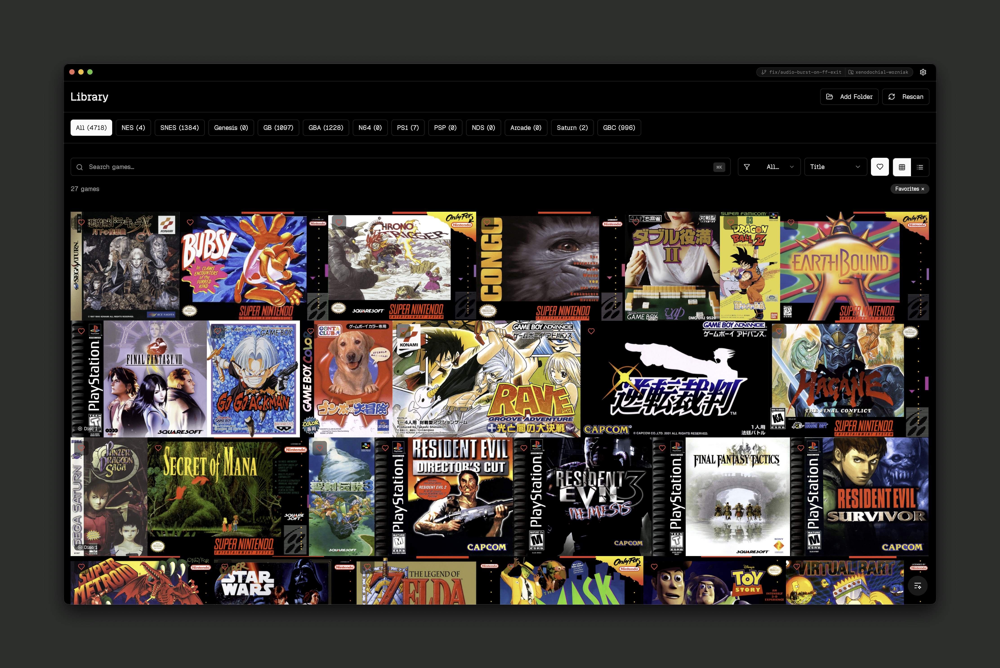
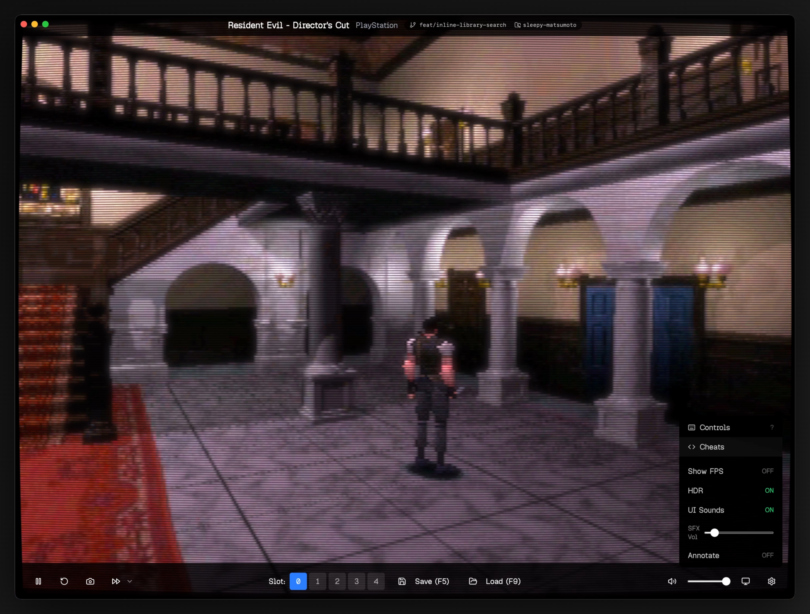

<p align="center">
  
</p>

<h1 align="center">GameLord</h1>

<p align="center">A vibesmaxxed emulation frontend built with Electron, React, and TypeScript.</p>

<p align="center">
  
  <a href="https://github.com/ryanmagoon/gamelord/actions/workflows/ci.yml"></a>
  <a href="https://github.com/ryanmagoon/gamelord/releases?q=nightly&expanded=true"></a>
  <a href="LICENSE"></a>
</p>

<p align="center">
  
</p>

<p align="center">
  
</p>

## Features

- **Libretro core support** — Runs cores natively via a C++ addon
- **WebGL rendering with CRT shaders** — Scanlines, curvature, bloom, and other retro effects via multi-pass WebGL2 shaders
- **Library management** — Automatic ROM scanning, metadata lookup, and cover art sync
- **Save states** — Multiple slots with autosave on close
- **Multi-disc swap** — Swap discs mid-game for multi-disc PSX titles
- **Cheat support** — RetroArch `.cht` files and DuckStation chtdb database

## Supported Systems

| System | Cores |
|--------|-------|
| Arcade | MAME |
| Game Boy | Gambatte, mGBA |
| Game Boy Advance | mGBA, VBA Next |
| Game Boy Color | Gambatte, mGBA |
| Genesis / Mega Drive | Genesis Plus GX, PicoDrive |
| N64 | Mupen64Plus Next, ParaLLEl N64 |
| Nintendo DS | DeSmuME |
| NES | fceumm, Nestopia, Mesen |
| PSP | PPSSPP |
| PlayStation | PCSX ReARMed, Beetle PSX HW, SwanStation |
| Sega Saturn | Beetle Saturn, Yabause |
| SNES | Snes9x, bsnes |

More systems are on the way — the goal is to support any libretro-compatible core.

## Getting Started

### Prerequisites

- Node.js 18+
- pnpm 9+
- **macOS:** Xcode Command Line Tools (for the native addon)
- **Windows:** Visual Studio Build Tools with the C++ workload

### Setup

```bash
git clone https://github.com/ryanmagoon/gamelord.git
cd gamelord
pnpm install

# Build the native addon (required for emulation)
cd apps/desktop/native && npx node-gyp rebuild && cd ../../..

# Start development
pnpm dev
```

### Other Commands

```bash
pnpm test          # Run tests
pnpm lint          # Lint
pnpm typecheck     # Type check
pnpm storybook     # Component browser
```

## Contributing

See [CONTRIBUTING.md](CONTRIBUTING.md) for setup instructions and development workflow. For a deep dive into how the app is structured, check out [ARCHITECTURE.md](ARCHITECTURE.md).

## Sponsors

<a href="https://sentry.io">
  <picture>
    <source media="(prefers-color-scheme: dark)" srcset=".github/assets/sentry-light.svg" />
    <source media="(prefers-color-scheme: light)" srcset=".github/assets/sentry-dark.svg" />
    
  </picture>
</a>

## License

[MIT](LICENSE)
