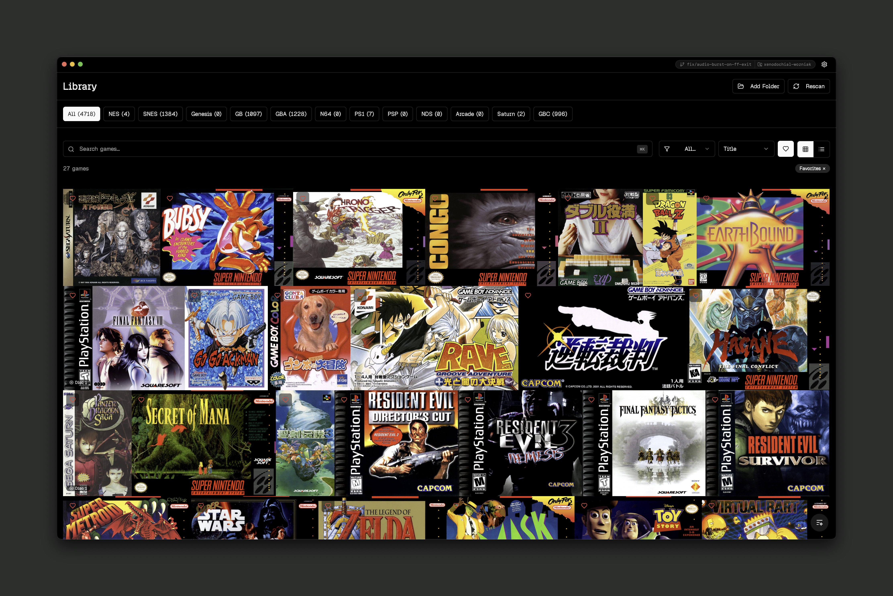
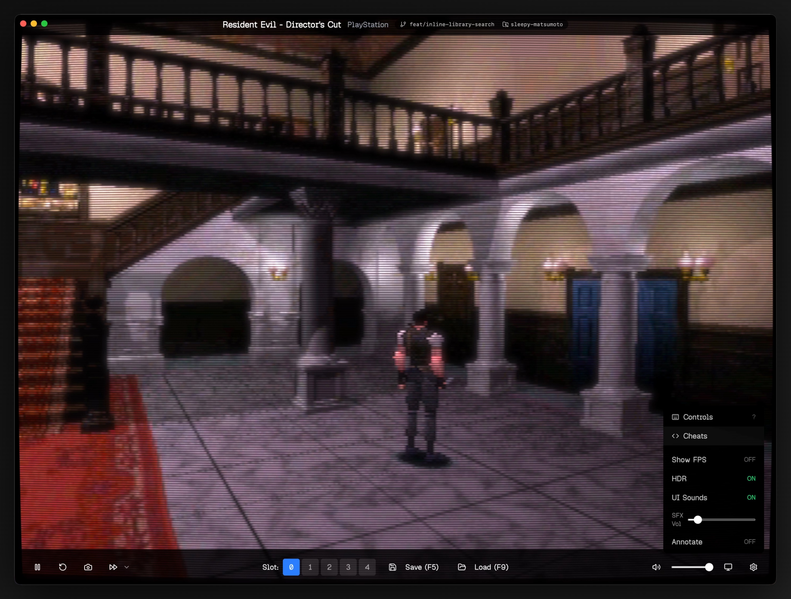

<p align="center">
  
</p>

<h1 align="center">GameLord</h1>

<p align="center">A vibesmaxxed emulation frontend built with Electron, React, and TypeScript.</p>

<p align="center">
  
  <a href="https://github.com/ryanmagoon/gamelord/actions/workflows/ci.yml"></a>
  <a href="https://github.com/ryanmagoon/gamelord/releases?q=nightly&expanded=true"></a>
  <a href="LICENSE"></a>
  <a href="https://github.com/ryanmagoon/gamelord/commits/main"></a>
  
</p>

<p align="center">
  
</p>

<p align="center">
  
</p>

## Features

- **Cores run in-process** — libretro cores are `dlopen`'d directly by a native N-API addon. No separate emulator install, no external process to hand frames across, no second set of config files to reconcile.
- **Frame pacing is a first-class concern** — the emulation loop runs in a dedicated utility process with hybrid sleep+spin timing (~0.1–0.5ms jitter), and the renderer draws on `requestAnimationFrame`, so frames land on vsync instead of whenever the event loop gets to them.
- **18 shader presets** — a multi-pass WebGL2 pipeline covering CRT Geom and Geom Deluxe, aperture grille, NTSC composite, GBA and PSP LCD grids, and the xBRZ and SABR upscalers. The choice is remembered per system.
- **Content-hash metadata lookup** — ROMs are identified by MD5 against ScreenScraper, with a name search only as a fallback, so box art and metadata don't depend on how you named your files.
- **Cores fetched on demand** — pick a game, and the core it needs downloads and installs itself with progress in the library view.
- **Playable before you supply a ROM** — permissively-licensed homebrew ships with the app and imports itself on first launch.

Save states, mid-game disc swapping, and cheat files are all supported. They're listed here once and not sold, because every emulation frontend has them.

## Isn't this stupid?

Partly. There's a reason this isn't a crowded field, and it's worth being specific about which of those reasons turned out to be real.

**The objection everyone leads with is JavaScript, and it's the wrong one.** No JavaScript runs per frame. Cores are native code behind an N-API addon, the emulation loop lives in its own utility process, and V8 is nowhere near the hot path. Frames reach the renderer through a lock-free double-buffered `SharedArrayBuffer` and audio through a single-producer ring buffer, so there's no per-frame serialization and nothing to garbage-collect. Uploading a texture and drawing it with a shader is the one thing a browser engine is genuinely best at. That part was never the hard part.

**The real costs are less exciting than the imagined ones.**

- **Input takes the long way around.** Key presses are captured in the renderer and forwarded over IPC through the main process to the emulation worker. Video and audio got the shared-memory treatment; input didn't. A native frontend polls the device on the same thread as the core and pays none of this.
- **Timers are a lie.** `setTimeout` bottoms out around 4ms and jitters under load, which is useless against a 16.67ms budget. So the loop burns CPU spin-waiting the last 2ms of every frame to hit its deadline. It works. It is not elegant.
- **The memory floor is a browser engine.** Before a single ROM loads, the baseline is whatever Chromium costs that week.
- **Shipping is three problems wearing a trenchcoat.** A signed and notarized app, a native addon compiled per architecture, and core binaries that have to arrive from somewhere.

Stupid in the places you'd expect, then — and less stupid than you'd expect in the place everyone points at. The bet is that a frontend gets judged on library browsing, artwork, shaders, and how it feels to use, and that those are all UI problems. UI is what this stack is for.

## Supported Systems

| System | Cores |
|--------|-------|
| Arcade | MAME |
| Game Boy | Gambatte, mGBA |
| Game Boy Advance | mGBA, VBA Next |
| Game Boy Color | Gambatte, mGBA |
| Genesis / Mega Drive | Genesis Plus GX, PicoDrive |
| N64 | Mupen64Plus Next, ParaLLEl N64 |
| Nintendo DS | DeSmuME |
| NES | fceumm, Nestopia, Mesen |
| PSP | PPSSPP |
| PlayStation | PCSX ReARMed, Beetle PSX HW, SwanStation |
| Sega Saturn | Beetle Saturn, Yabause |
| SNES | Snes9x, bsnes |

More systems are on the way — the goal is to support any libretro-compatible core.

## Getting Started

### Prerequisites

- Node.js 18+
- pnpm 9+
- **macOS:** Xcode Command Line Tools (for the native addon)
- **Windows:** Visual Studio Build Tools with the C++ workload

### Setup

```bash
git clone https://github.com/ryanmagoon/gamelord.git
cd gamelord
pnpm install

# Build the native addon (required for emulation)
cd apps/desktop/native && npx node-gyp rebuild && cd ../../..

# Start development
pnpm dev
```

### Other Commands

```bash
pnpm test          # Run tests
pnpm lint          # Lint
pnpm typecheck     # Type check
pnpm storybook     # Component browser
```

## Contributing

See [CONTRIBUTING.md](CONTRIBUTING.md) for setup instructions and development workflow. For a deep dive into how the app is structured, check out [ARCHITECTURE.md](ARCHITECTURE.md).

## Sponsors

<a href="https://sentry.io">
  <picture>
    <source media="(prefers-color-scheme: dark)" srcset=".github/assets/sentry-light.svg" />
    <source media="(prefers-color-scheme: light)" srcset=".github/assets/sentry-dark.svg" />
    
  </picture>
</a>

## License

[MIT](LICENSE)
